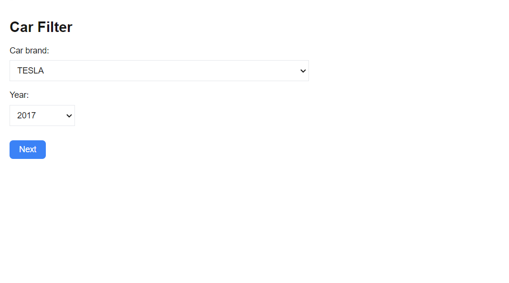
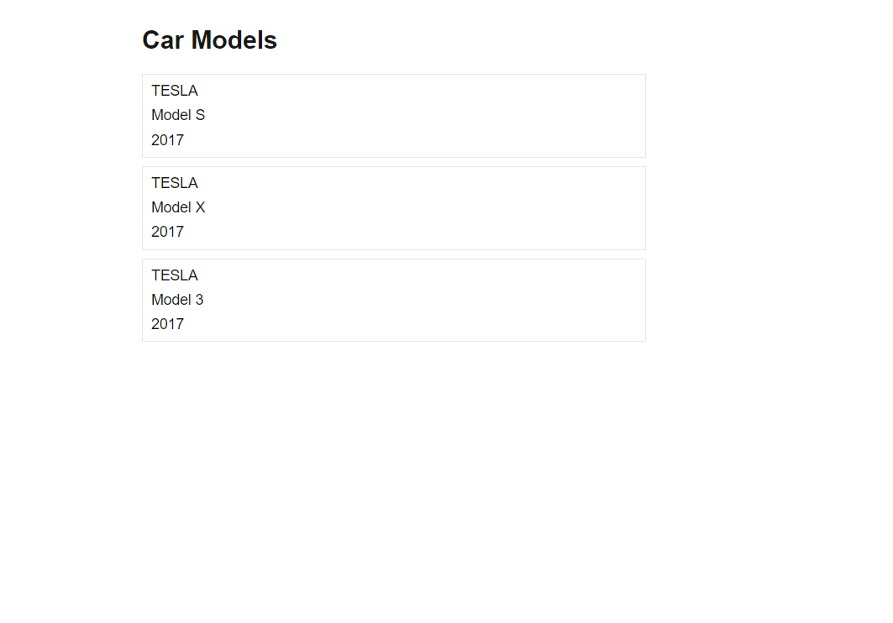
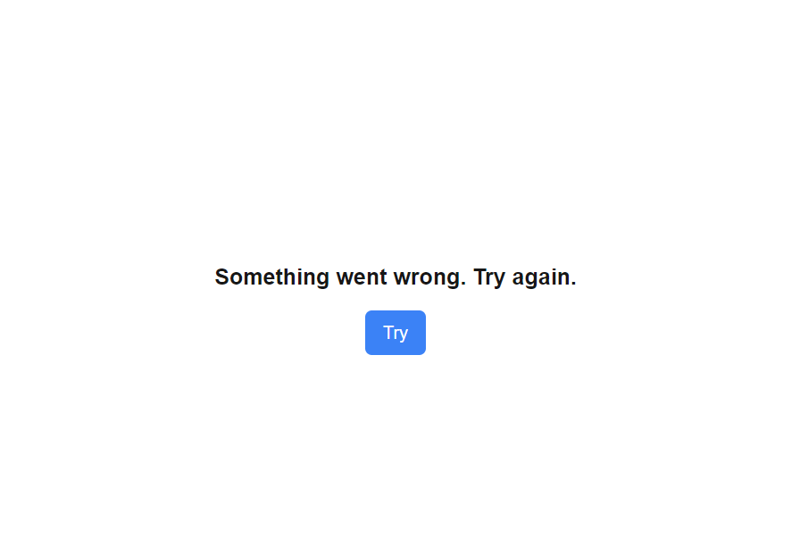

# Test work The Car Dealer App

This project is an application for filtering cars by brand and year. It is implemented using
**Next.js 14**, **Tailwind CSS** with support for Server Components, dynamic page generation using
generateStaticParams, and integration with an external API to fetch vehicle model data.

## Оглавление

- [Installation](#installation)
- [Running the Project](#running-the-project)
- [Environment Variables](#environment-variables)
- [Technologies Used](#technologies-used)
- [Screenshots](#screenshots)

## Installation

Follow these steps to set up the project locally:

1. Clone the repository:

```
   git clone https://github.com/Demetryj/car-dealer-app.git
```

2. Install dependencies:

```
   npm install or yarn install
```

## Running the Project

1. To run the project in development mode:

```
   npm run dev or yarn dev
```

The project will be accessible at http://localhost:3000.

2. To build the production version:

```
   npm run build
```

3. To start the production build:

```
   npm start
```

## Environment Variables

The project uses environment variables for API interactions. All environment variables should be
stored in a .env.local file. Example:

1. Create a .env.local file in the root of the project
2. Add the following environment variables: NEXT_PUBLIC_API_BASE_URL=https://vpic.nhtsa.dot.gov/api

## Technologies Used

- Next.js: Framework for React applications with Server Components support.
- Tailwind CSS: A utility-first CSS framework for styling.
- fetch API: For making requests to external APIs.
- React Suspense: For handling data loading with fallback UI.

## Screenshots

1. **Home page, filtering:**

   

   

2. **Results page:**

   

3. **Error page:**

   

   
